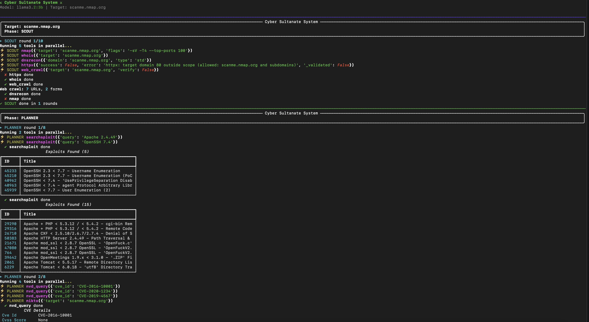
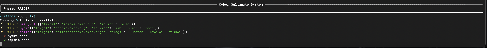

# Cyber Sultanate System (CSS)


A **fully autonomous** penetration testing agent that runs locally, uses a local LLM, and focuses on what actually matters: finding the known vulnerabilities you haven't patched yet — without you babysitting it.

## Table of Contents

- [Why This Exists](#why-this-exists)
- [How It Works](#how-it-works-fully-autonomous)
- [Requirements](#requirements)
- [Installation](#installation)
- [Usage](#usage)
  - [Model Selection](#model-selection)
  - [Proxies & Tor](#proxies--tor)
- [Output](#output)
- [Example Workflow](#example-workflow)
- [CSS in Action](#css-in-action)
- [Security & Scope](#security--scope)
- [Configuration](#configuration)
- [Proxy & Tor](#proxy--tor)
- [What It Doesn't Do](#what-it-doesnt-do)
- [License](#license)

## Why This Exists

Most breaches aren't zero-days. They're unpatched CVEs, default credentials, exposed services, and misconfigurations that have had fixes for months — sometimes years. CSS doesn't hunt for novel exploits. It systematically reconnoiters, correlates findings with exploit databases, and attempts exploitation using standard tools. All on your machine. No cloud API keys. No data leaves your network.

## How It Works (Fully Autonomous)

You run one command. The agent does the rest — no prompts, no "what's next?" decisions, no manual tool invocation.

```
css run example.com --model llama3.2:3b
```

**Phase 1 — SCOUT (Reconnaissance)**
The LLM drives real tools autonomously: `nmap`, `whatweb`, `gobuster`, `ffuf`, `dnsrecon`, `whois`, `httpx`, `web_crawl`. It decides what to run next based on previous results, runs independent tools in parallel, and stops when it concludes the picture is complete.

**Phase 2 — PLANNER (Vulnerability Analysis)**
Using only the services Scout confirmed, the LLM queries `searchsploit` for exploits, `nvd_query` for CVE scores, and optionally runs `nikto` on web targets. It deduplicates findings and flags which ones have public exploits.

**Phase 3 — RAIDER (Exploitation) — conditional**
If Planner found exploitable vulnerabilities, the LLM attempts exploitation with `sqlmap`, `hydra`, `metasploit`, or `nmap_vuln`. It reports success or failure honestly. If nothing exploitable was found, Raider never runs.

You get a final report. No intermediate prompts. No "what should I do next?" decisions.

## Requirements

- **Ollama** running locally (`ollama serve`) with a model pulled (e.g., `ollama pull llama3.2:3b`)
- **System tools** (install via package manager):
  - nmap, gobuster, ffuf, dnsrecon, whois, searchsploit, nikto, sqlmap, hydra, metasploit-framework
- Python 3.11+
- **Linux or macOS** — Windows is not supported. While many of the required tools have Windows ports, the agent shells out commands using Unix paths and POSIX conventions, and hasn't been adapted for a Windows environment.

```bash
# Quick check
css doctor
```

## Installation

```bash
pip install -e .
# or
pipx install .
```

## Usage

```bash
# Basic scan
css run example.com

# With options
css run example.com --model llama3.2:3b --max-workers 8 --output report.json

# Skip exploitation phase
css run example.com --skip-raider

# List available Ollama models
css list-models

# Check tool availability
css doctor
```

### Model Selection

CSS works with any Ollama model. To choose one:

```bash
# List models available on your machine
css list-models

# Or check what Ollama has directly
ollama ls

# Run with a specific model
css run example.com --model llama3.2:3b
css run example.com --model mistral:7b
css run example.com --model qwen2.5:7b
css run example.com --model codellama:7b
```

Larger models (14B+) tend to produce more reliable decisions but are slower. Smaller models (3B–7B) are faster but may occasionally misinterpret tool output. Experiment to find the best balance for your setup.

### Proxies & Tor

Route all scan traffic through a proxy or Tor to avoid source-IP blocking and add a layer of anonymity. CSS supports any SOCKS5 or HTTP proxy.

```bash
# Route through a SOCKS5 proxy
css run example.com --proxy socks5://127.0.0.1:9050

# Shorthand for Tor (socks5://127.0.0.1:9050)
css run example.com --tor

# Route through an HTTP proxy
css run example.com --proxy http://proxy.company.com:8080

# Don't filter localhost from the proxy (for debugging)
css run example.com --proxy http://proxy:8080 --proxy-dns
```

**How it works:** When `--proxy` or `--tor` is set, CSS injects `HTTP_PROXY`, `HTTPS_PROXY`, and `ALL_PROXY` environment variables into every subprocess it spawns (`nmap`, `sqlmap`, `gobuster`, etc.). In-process `httpx` calls (whatweb, web_crawl, NVD queries) receive the proxy directly. Localhost and the Ollama API server are automatically added to `NO_PROXY` so the LLM stays local.

**Notes:**
- SOCKS5 proxy support requires `httpx[socks]` — run `pip install httpx[socks]` if not already installed
- nmap's SYN scan (`-sS`) doesn't work through proxies; CSS uses the default TCP connect scan
- Proxy latency adds to scan time, especially over Tor

## Output

- **Console**: Live progress with colored tables for open ports, exploits, findings
- **JSON** (`--output report.json`): Structured data for pipelines
- **Text** (`--output report.txt`): Human-readable final report

## Example Workflow

```
$ css run 192.168.1.50
⚔ Cyber Sultanate System ⚔
Model: llama3.2:3b | Target: 192.168.1.50

▸ SCOUT round 1/10
  ⚡ SCOUT nmap(target=192.168.1.50, flags=-sV -T4 --top-ports 100)
  ✔ nmap done
  Open Ports (3):
    22/tcp  ssh  OpenSSH 8.9
    80/tcp  http  Apache 2.4.52
    443/tcp https  Apache 2.4.52
  ...

▸ PLANNER round 1/8
  ⚡ PLANNER searchsploit(query=Apache 2.4.52)
  ✔ searchsploit done
  Exploits Found (2):
    50383: Apache 2.4.52 - Path Traversal
    49999: Apache 2.4.49/2.4.50 - Path Traversal
  ...

▸ RAIDER round 1/8
  ⚡ RAIDER sqlmap(target=http://192.168.1.50/login.php, flags=--batch --level=1 --risk=1)
  ...

Final Report:
[SCOUT RECONNAISSANCE]
  Target: 192.168.1.50
  Open Ports: 22/tcp, 80/tcp, 443/tcp
  Web Technologies: Apache 2.4.52, OpenSSL 3.0.2

[PLANNER VULNERABILITY ASSESSMENT]
  - Apache 2.4.52
    CVE: CVE-2021-41773  CVSS: 7.5
    Exploit: True
    Summary: Path traversal in Apache HTTP Server 2.4.49/2.4.50

[RAIDER EXPLOITATION]
  - SQL Injection: Not vulnerable
```

## CSS in Action

CSS running against `scanme.nmap.org`:





## Security & Scope

- **Target allowlist**: LLM can only scan the original target or its subdomains. Explicit IPs must match exactly.
- **SSL verification**: Off by default for pentest compatibility. Enable with `--verify-ssl`.
- **No cloud calls**: Only local Ollama and local tools. NVD queries are the sole external request (cached, rate-limited).

## Configuration

```bash
css run target \
  --model llama3.2:3b \      # Ollama model
  --max-workers 4 \          # Parallel tool executions
  --verify-ssl \             # Enable TLS verification
  --skip-raider \            # Recon + vuln scan only
  --verbose \                # Show LLM responses
  --output report.json \     # Save report to file
  --proxy socks5://... \     # Proxy URL for all traffic
  --tor \                    # Route through Tor
  --proxy-dns                # Proxy DNS lookups too
```

## Proxy & Tor

CSS supports routing all scan traffic through an HTTP or SOCKS5 proxy, including Tor. This applies to:

- **Subprocess tools**: `nmap`, `sqlmap`, `gobuster`, `ffuf`, `nikto`, `hydra`, `whois`, `dnsrecon`, `searchsploit`, `metasploit`, `shodan` — via standard `HTTP_PROXY`/`HTTPS_PROXY`/`ALL_PROXY` environment variables (set automatically).
- **Python HTTP calls**: `whatweb` (fallback), `httpx`, `web_crawl`, NVD queries — via `httpx` proxy support.

### Usage

```bash
# Explicit proxy (HTTP or SOCKS5)
css run example.com --proxy http://proxy:8080
css run example.com --proxy socks5://127.0.0.1:9050

# Tor shortcut (assumes tor running on socks5://127.0.0.1:9050)
css run example.com --tor

# Proxy DNS too (may leak if tools don't support it)
css run example.com --tor --proxy-dns
```

### What Works / What Doesn't

| Category | Works? | Notes |
|----------|--------|-------|
| nmap TCP connect scan (`-sT`) | ✅ | SYN scan (`-sS`) bypasses proxy — not supported |
| sqlmap, gobuster, ffuf, nikto, hydra | ✅ | Respect `ALL_PROXY` env var |
| whatweb, httpx, web_crawl, NVD API | ✅ | Use `httpx` with explicit proxy |
| dnsrecon, whois | ⚠️ | May leak DNS unless `--proxy-dns` (limited support) |
| searchsploit, metasploit, shodan | ⚠️ | Local tools or use local sockets — may not route |

### Caveats

- **Performance**: Tor adds 2–5s latency per request. Parallel workers (`-w`) will idle waiting on proxy responses.
- **False negatives**: Tor exit nodes are heavily WAF-rate-limited; you may miss findings visible from a clean IP.
- **Ollama stays local**: The LLM API (`http://localhost:11434`) is excluded from proxy routing automatically via `NO_PROXY`.
- **SOCKS5 support**: Requires `httpx[socks]` extra (`pip install 'httpx[socks]'`). If missing, HTTP proxies still work.

## What It Doesn't Do

- Find zero-days (by design)
- Bypass WAFs or advanced defenses automatically
- Replace a skilled penetration tester
- Guarantee coverage — it's only as good as the tools and wordlists you provide

## License

MIT — use it, modify it, distribute it. Just don't scan what you don't own.

---

**Found it useful?** Give it a ⭐ on GitHub — it helps others discover the project.

---

*Built for defenders who'd rather find their own holes first. The Sultanate watches. You patch.*